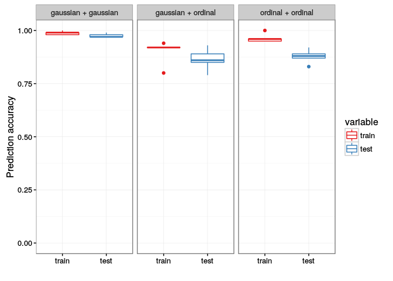
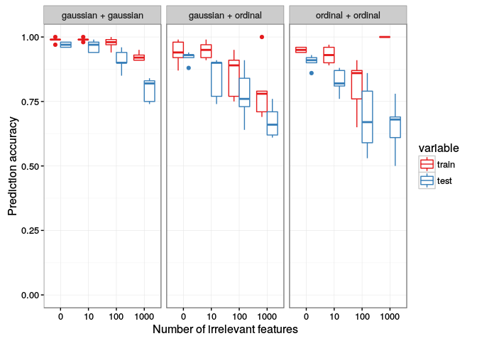
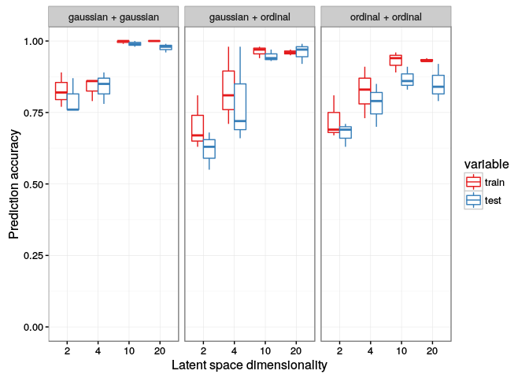

# Testing MLFS method on simulated data

Generate two views, both with 10 features. Altogether 200 data points (100 for training, 100 for testing). 

- Two Gaussian views
- One gaussian, one ordinal (with 3 levels)
- Both ordinal views (both with 3 levels)

### Sanity check

Perfect scenario (data generated exactly according to the model). 

### Can the model handle large number of irrelevant features?

Each view has (10 + irrelevant) features now

### What if the dimensionality of latent space is misspecified?

In the generated data, the underlying latent space was 6-dimensional. When fitting the model, lets consider misspecified values $\{2, 4 < 6 < 10, 20\}$. 

